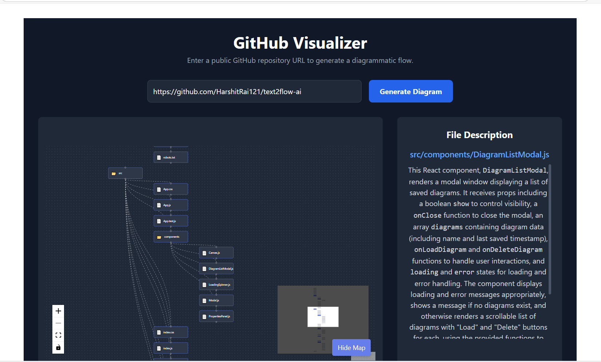

# GitHub Visualizer



Welcome to **GitHub Visualizer** — a powerful web tool that transforms any public GitHub repository into an interactive, AI-powered file tree diagram. Whether you're exploring a new open-source project or showcasing your own, this app gives you a clear, intelligent overview of the repo's structure and contents.

---

## 🚀 Live Demo

👉 [github-visualizer.vercel.app](https://github-visualizer.vercel.app)

---

## ✨ Features

- ⚙️ **Interactive File Diagram**  
  Visualize repository folders and files using a dynamic tree layout powered by React Flow.

- 🧠 **AI-Powered File Descriptions**  
  Click any file to get a concise summary of its purpose and logic, powered by **Gemini 1.5 Flash API**.

- 🚀 **Optimized Performance**  
  Loads file content and descriptions on demand to keep the experience fast and responsive.

- 📱 **Mobile-First Design**  
  Fully responsive layout with a collapsible minimap and scroll-to-description UX for smaller screens.

- 🔐 **Secure API Handling**  
  Uses `.env` files to manage API keys securely for production environments.

---

## 🛠️ How to Use

1. Open the app using the [Live Demo](https://github-visualizer.vercel.app) link.
   
2. Paste any **public GitHub repository URL**, e.g.,  
   `https://github.com/facebook/react`
   
3. Click **"Generate Diagram"**.
   
4. Explore the repository’s structure visually.
   
5. Click on any file to get an **AI-generated description**.

---

## 🧱 Tech Stack

### 🖥️ Frontend

- **React** (with Vite) – Lightning-fast SPA development
- **React Flow** – Interactive diagram nodes and edges
- **Tailwind CSS** – Utility-first styling & responsive layout
- **React Markdown** – To render AI-generated markdown descriptions

### ⚙️ Backend

- **Node.js + Express** – Lightweight API server
- **Gemini 1.5 Flash API** – For intelligent file summaries
- **Axios** – HTTP requests to GitHub & Gemini
- **dotenv** – Manage environment variables

---

## 🚧 Getting Started

### 📋 Prerequisites

- [Node.js](https://nodejs.org/) installed (v18+ recommended)
- A valid **Gemini 1.5 Flash API key**

---

### 🔧 1. Configure Environment Variables

Create a `.env` file inside the `server` directory:

```bash
# server/.env
GEMINI_API_KEY=your_gemini_api_key_here
```

### 📦 2. Install Dependencies

```
# Install frontend dependencies
npm install

# Install backend dependencies
cd server
npm install
```

### ▶️ 3. Run the Application

Open two terminals — one for the backend, one for the frontend:

Terminal 1 – Backend
```
cd server
node index.js
```

Terminal 2 – Frontend
```
npm run dev
```

Now visit:
http://localhost:5173 🎉

## ☁️ Deployment

This project is easily deployable on Vercel. The included vercel.json automatically handles build and serverless API routing.

Steps:

- Push your code to GitHub.

- Import the repo on vercel.com.

- Set the environment variable GEMINI_API_KEY in the Vercel dashboard.

Deploy!

## 👨‍💻 Author
Harshit Rai
https://github.com/HarshitRai121

